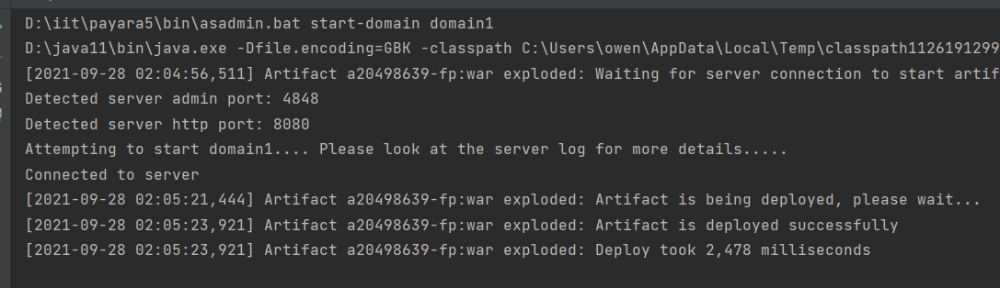
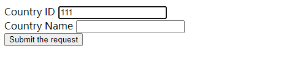
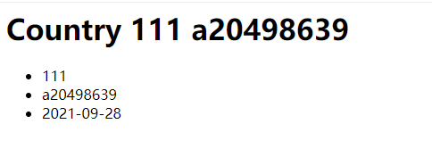

a20498639 lab4 README.md

1.Your understanding of the difference between the forward and redirect operations.

The run speed of forward is faster than that of redirect operations.
The distance of forward and redirection is different, which is server side and client side respectively.
The code will not be executed after forwarding, but redirection is on the contrary.
The request of forward is the same, while that of redirection is two different request.

2.How would you be validating user submissions without the Bean Validation API standard?

Verifying submissions of users on the server can be a good method.

3.How do you think this approach would scale to a real application with 100's of entities?

The support of database is necessary at that circumstance in my perspective.

4.Why didn't we need to include any additional dependencies (i.e. Bean Validation, JDBC) in Lab 4, like we did in Lab 3?

We have included the Jakarta enterprise network, and all the dependencies have been included.

